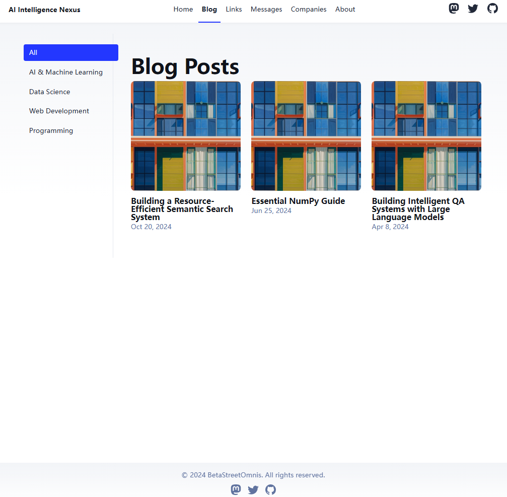
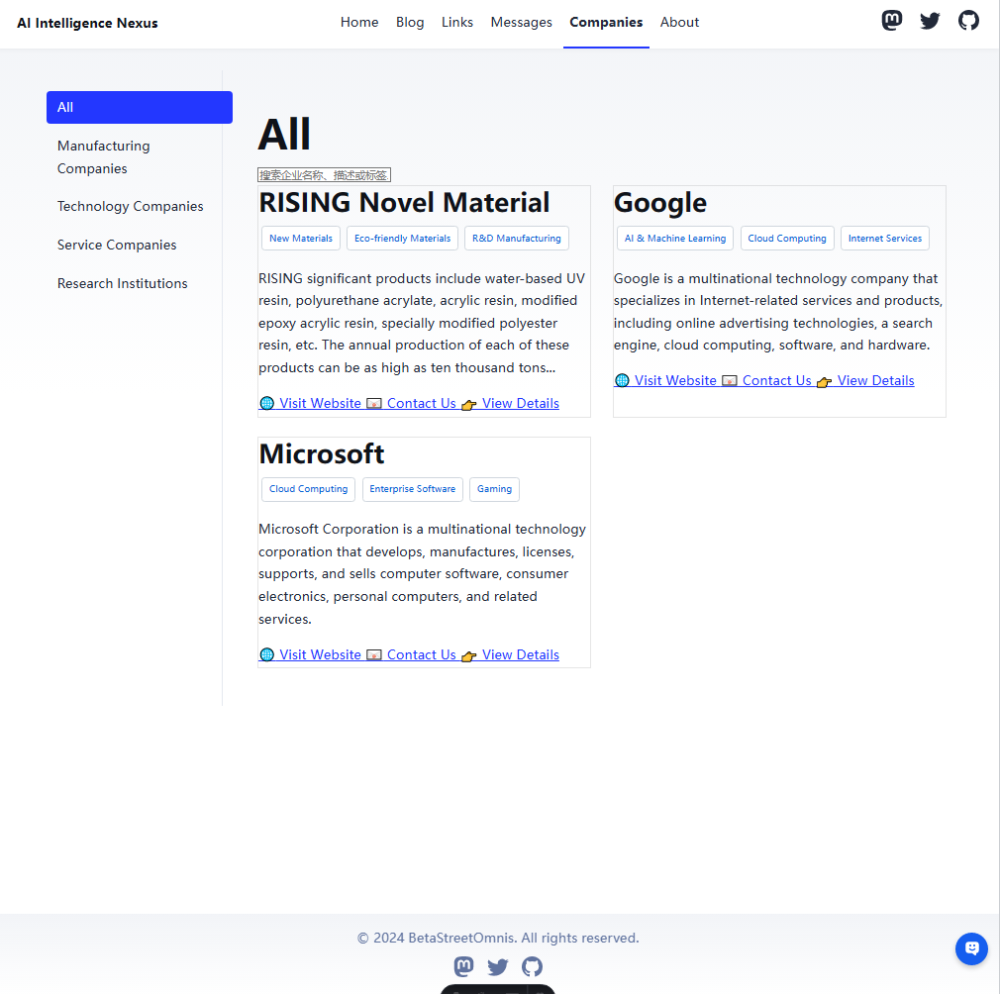
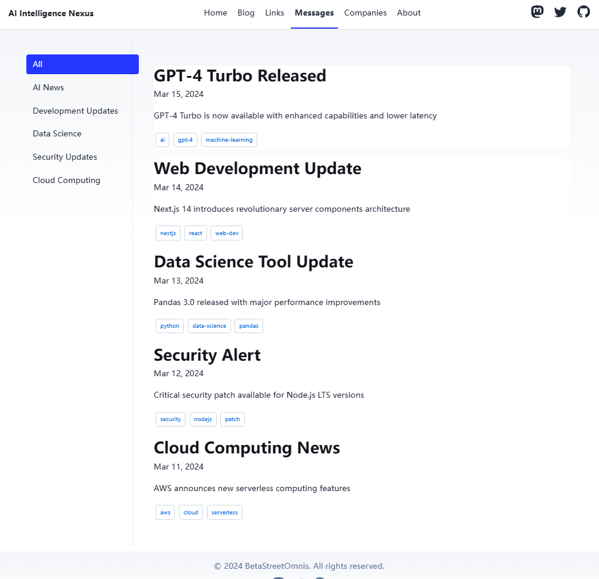
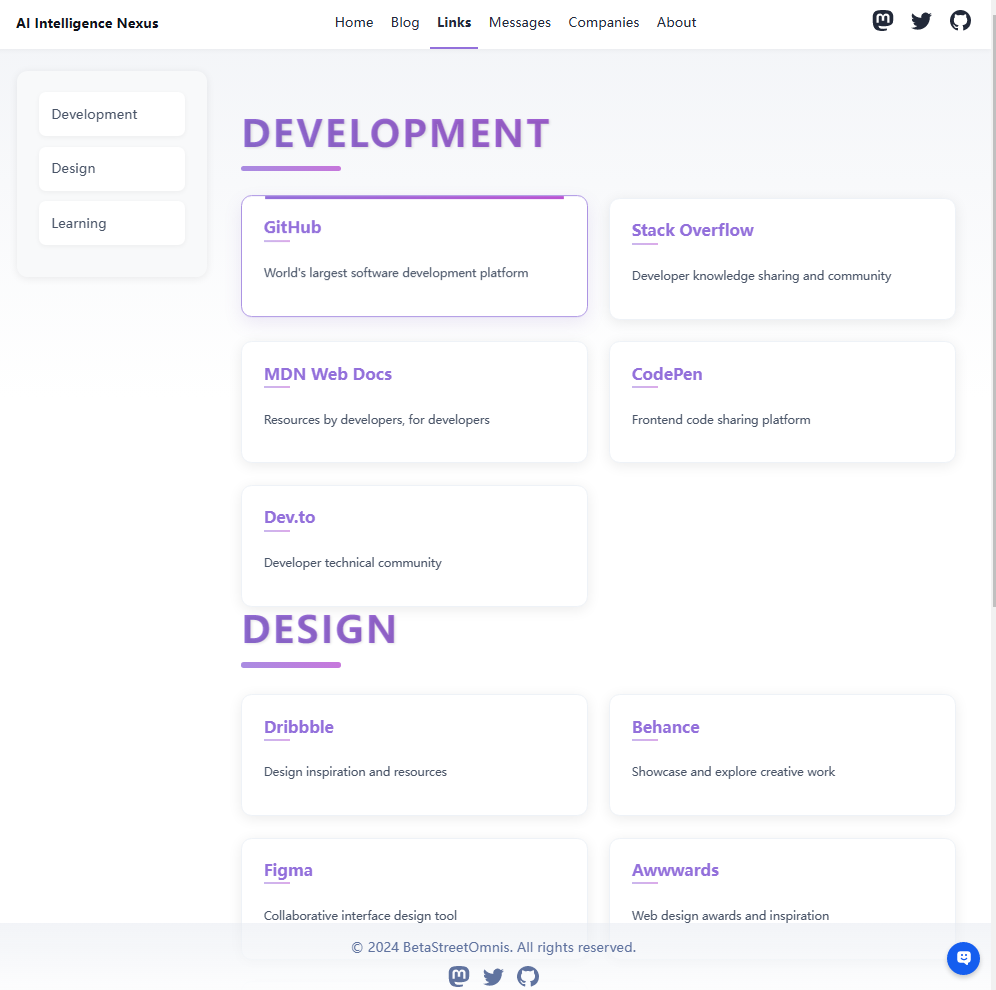

# AI Information Navigator

A comprehensive information platform built with Astro, featuring AI-related blogs, company profiles, tech news, and resource links.

[](https://astro.build)

> 🤖 **Welcome to AI Info Navigator!** A one-stop platform for AI-related information.

🌐 **Demo**: [https://astronavigator-5s.pages.dev/blog/](https://astronavigator-5s.pages.dev/blog/)

## 🎯 Project Purpose

This project was born out of a need for better navigation and organization of AI-related content. While exploring Astro templates, we found that existing solutions lacked proper navigation capabilities and blog categorization features. Most blog templates were either too simple or couldn't effectively categorize content. Therefore, we built and open-sourced this project to provide a comprehensive, well-organized platform for AI information.

## 📸 Screenshots

### Blog Navigation Page


### Company List Page


### Message Center


### Resource Links Page


Features:

- ✅ Multi-category content management (Blog, Companies, Messages, Links)
- ✅ Dynamic category-based filtering
- ✅ Company profiles with detailed information
- ✅ Latest AI news and tech updates
- ✅ Curated resource links collection
- ✅ SEO-friendly with canonical URLs and OpenGraph data
- ✅ Responsive design for all devices

## 🚀 Project Structure

Inside of the project, you'll see the following folders and files:

```text
├── public/
├── src/
│   ├── components/          # UI components
│   │   ├── BaseHead.astro
│   │   ├── Header.astro
│   │   ├── Sidebar.astro
│   │   └── ...
│   ├── content/            # Blog content
│   │   └── blog/
│   ├── data/              # Data files
│   │   ├── companies.ts
│   │   ├── messages.ts
│   │   └── categories.ts
│   ├── layouts/           # Layout components
│   │   ├── BaseLayout.astro
│   │   └── BlogPost.astro
│   └── pages/             # Route pages
│       ├── blog/
│       ├── companies/
│       └── messages/
├── astro.config.mjs
└── package.json
```

The `src/data/` directory contains structured data for companies, messages, and category definitions. The `src/pages/` directory contains all route pages with category-based filtering support.

## 🧞 Commands

All commands are run from the root of the project, from a terminal:

| Command                   | Action                                           |
| :------------------------ | :----------------------------------------------- |
| `npm install`             | Installs dependencies                            |
| `npm run dev`             | Starts local dev server at `localhost:4321`      |
| `npm run build`           | Build your production site to `./dist/`          |
| `npm run preview`         | Preview your build locally, before deploying     |
| `npm run astro ...`       | Run CLI commands like `astro add`, `astro check` |
| `npm run astro -- --help` | Get help using the Astro CLI                     |

## 👀 Content Categories

### Blog Categories
- AI & Machine Learning
- Data Science
- Web Development
- Programming

### Company Categories
- Manufacturing Companies
- Technology Companies
- Service Companies
- Research Institutions

### Message Categories
- AI News
- Development Updates
- Data Science
- Security Updates
- Cloud Computing

## 🔗 Resource Links
- Development Tools
- AI Resources
- Learning Platforms
- Design Resources

## Want to learn more?

Check out [Astro documentation](https://docs.astro.build) or visit our project repository for more information.

## Credit

This project is built with [Astro](https://astro.build) and inspired by various open-source projects.


